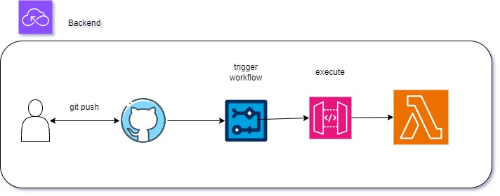

<strong>Automatische Bereitstellung: </strong>

Bei jedem Commit in den main-Branch wird automatisch eine Bereitstellung deiner Serverless-Anwendung in deinem AWS-Account ausgelöst.

<strong>Infrastruktur als Code: </strong>

Der Workflow ermöglicht die Nutzung von Infrastruktur als Code, da die Bereitstellungslogik direkt im Workflow-Code definiert ist. Dies fördert bewährte Praktiken für die Verwaltung von Infrastruktur.

<strong> Erweiterbarkeit der Funktionen: </strong>

Die Automatisierung des Deployments ermöglicht es, schnell und effizient neue Funktionen zu implementieren und zu testen. Das Hinzufügen von Funktionen kann nahtlos in den Entwicklungsprozess integriert werden.

# Abschlussprojekt AWS-23-02

Dockerfile(s)/Playbook(s), um das Frontend in Container durch das *CI/CD-Team* zu deploy'en.

## Weitere Teile des Projekts
*als Submodule eingebunden:*
- [Frontend/DB](https://github.com/ChriZZ2406/Abschlussprojekt-Front-Backend)
- [Backend](https://github.com/BastiWho/Abschlussprojekt_Backend)
- [IaC](https://github.com/ramziatrous/Abschlussprojekt-Terraform-AWS)

### Informationen für Entwickler
- [Git](./git.md) - Struktur & Workflow für das Projekt
- [Git Submodule](./git-submodule.md) - Workflow